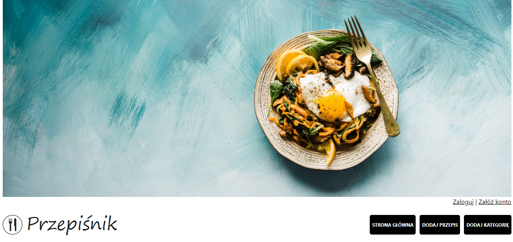
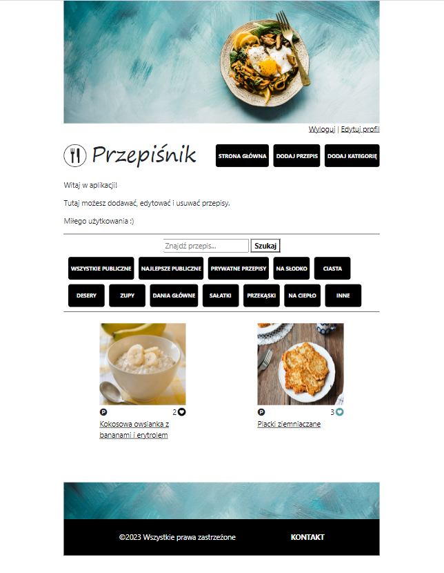

# Przepiśnik - personal cookbook web app

> This app is designed to store and manage cooking recipes. More in section [General Info](#general-information).
> Przepiśnik demo [_here_](https://).
> Admin panel demo [_here_](https://).

## Content of project

- [General Info](#general-information)
- [Technologies Used](#technologies-used)
- [Features](#features)
- [Screenshots](#screenshots)
- [Setup](#setup)
- [Usage](#usage)
- [Project Status](#project-status)
- [Room for Improvement](#room-for-improvement)
- [Sources](#sources)
- [Contact](#contact)

## General Information

  
Click here to see general information about <b>Przepiśnik App</b>.

  <b>Przepiśnik</b> is a web application where you can create and store recipes - both private and public (shared). You can edit and delete single recipes, like or unlike previously liked recipes, search through public recipes, find the best ones (with the highest amount of likes), check your private recipes, find all recipes added by a particular author, add categories, and browse through these categories. You can also register and manage some of your personal data saved in your account. There is also a simple panel for administration (admin access only). Save your family recipes and let people cook from them!

## Technologies Used

  

     - version 17
  

  

    

      
    

  

    

       - version 3.2.0
    

    

      <ul>
        <li>Thymeleaf layout dialect - version 3.3.0</li>
        <li>Thymeleaf extras spring security 6 - version 3.1.2</li>
      </ul>
    

  

  

    

       - version 3.2.0
    

    

      <ul>
        <li>Spring Data JPA</li>
        <li>Spring Security</li>
        <li>Spring Validation</li>
        <li>Spring Web</li>
        <li>Spring Test</li>
      </ul>
    

  

  

     - version 4.24.0
  

  

    
H2 Database - version 2.2.224

  

  

    
  

  

    
Lombok - version 1.18.30

  

  

    
  

  

    
  

  

    
  

  

    
  

  

    
JUnit - version 5.10.1

  

  

    
Mockito - version 5.7.0

  

  

    
AssertJ - version 3.24.2

  

## Features

Ready features:

<b>Recipes:</b>

<ul>
  <li>adding using form (with part of the fields with validation)</li>
  <li>editing own recipes</li>
  <li>deleting own recipes</li>
  <li>ability to like / unlike recipe</li>
  <li>ability to find other recipes added by this author by clicking a link</li>
</ul>

<b>Category:</b>

<ul>
  <li>adding using form, ability to add category photo and short description</li>
  <li>deleting (only by admin)</li>
  <li>browsing through categories on home page</li>
</ul>

<b>publicly shared and personal recipes</b>

<b>showing best recipes (by number of likes)</b>

<b>search panel (searching by title)</b>

<b>admin / user account with ability to edit some data</b>

<b>admin panel with functions such as: deleting entire categories with recipes, change user roles</b>

## Screenshots

## Setup

- CLONING REPOSITORY

If you want to clone this repo and launch it for example in IntelliJ please write this in command line:

<code>$ git clone https://github.com/MalTok/Przepisnik.git</code>

- INSTALLATION

If ou want to download this repository and install it, please make sure that you have Java 17 (or newest) installed on
your comupter. Also make sure that the enviroment variable PATH is properly set.

Next please download the JAR file <b>przepisnik-0.0.1-SNAPSHOT.jar</b>.
In command line go to the directory with the JAR file and install it by writing this command:
<code>$ java -jar przepisnik-0.0.1-SNAPSHOT.jar</code>

After these steps it will be available in your browser at <code>localhost:8080</code>.

There are two configurations available: dev (default, recommended) and prod (requires MySQL installed).

Admin panel access:

- login: admin@wp.pl
- password: hard

Fictional user access:

- login: anka134@op.pl
- password: anka123

## Usage

  
Click here to see possible usage of <b>Przepiśnik</b>.

  This app can be deployed as a secure, online recipe storage platform. It can also be proper displayed on mobile devices, making its potential usage widespread.

## Project Status

Project is: _in progress_ 
Working on new, possible features.

## Room for Improvement

Room for improvement:

- Redesign form of ingredients adding
- Add ability to choose recipe photo strictly from disc
- Change way of deleting categories by admin (without deleting recipes)

## Sources

- This project was inspired by polish, very popular site "Kwestia Smaku" which recipes I frequently
  use [kwestiasmaku.com](https://www.kwestiasmaku.com/)
- Most of the pictures used on this site came from Google images and [freepik.com](https://pl.freepik.com/). Some of
  recipes photos are from [kwestiasmaku.com](https://www.kwestiasmaku.com/).

## Contact

Feel free to contact me via GitHub or e-mail!
